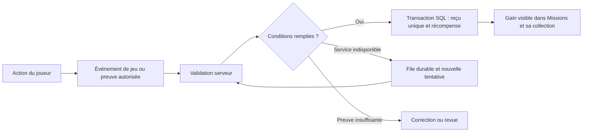

**Centre de missions : participation, partage et récompenses — proposition du 28 septembre 2026**

Statut : analyse initiale conservée comme référence. Après cette proposition, le parcours **capture envoyée par le joueur, vérification manuelle dans l’admin, attribution automatique après validation** a été retenu et implémenté localement. Voir [le périmètre livré et sa recette](CENTRE-MISSIONS-COMMUNAUTE-IMPLEMENTATION-2026-09-28.md). Les connecteurs sociaux, l’affiche générée et le nouveau parrainage de joueurs décrits ci-dessous restent des pistes futures, pas des fonctionnalités livrées. « Argent » désigne le solde virtuel du Placard, sans retrait en euros.

La recommandation est un centre unique qui récompense les contributions et la participation vérifiables dans le jeu, puis donne envie de les partager. La validation et l’attribution peuvent être automatiques ; la publication reste volontaire. Le mécanisme universel « connecter n’importe quel Instagram/X, suivre ou publier, recevoir un pack » ne peut pas être promis avec les accès et règles actuels.

**Ce qui existe et ce qu’il faut conserver**

Le Placard propose neuf missions dans trois parcours, avec des packs La Botte. Le compte contient séparément des missions sociales avec capture et revue administrateur. Le parrainage existant récompense une première commande éligible, pas simplement l’arrivée d’un nouveau joueur. Réunir les accès et l’historique sans effacer les progressions, requalifier les anciennes missions ou distribuer une seconde fois les gains.

Les deux moteurs n’offrent pas les mêmes garanties. `rpc_kq_claim_mission` verrouille l’utilisateur, recalcule sa progression et restitue un reçu existant au rejeu. Dans `reviewMissionSubmissionInSupabase`, le crédit et le statut de validation sont des requêtes séparées : une concurrence ou une panne peut permettre un double crédit. Le choix de récompense de parrainage présente un problème similaire. La création du choix du parrain intervient aussi après le RPC idempotent de commande : une panne intermédiaire peut laisser un gain manquant. Ce sont des risques observables dans le code, pas des incidents constatés sur les comptes.

Références locales : [centre actuel](../../src/components/placard/KqMissionCenter.tsx), [missions du compte](../../src/components/account/MissionsSection.tsx), [approbation sociale](../../src/lib/supabase/missions-backend.ts), [parrainage](../../src/lib/supabase/referral-backend.ts), [RPC missions Placard](../../supabase/migrations/20260913000500_kq_mission_center.sql).

**Faisabilité des demandes sociales**

| Action envisagée | Vérification et décision proposées |
| --- | --- |
| Follow X contre pack/Buddy/monnaie | Ne pas activer : les règles développeur interdisent la compensation monétaire ou virtuelle des actions X. |
| Post X parlant du jeu contre récompense | Même obstacle pour une mission rémunérant l’action de publier. Une API disponible ne constitue pas une autorisation de ce modèle. |
| Connexion Instagram pour tous les joueurs | Ne pas promettre : les intégrations documentées visent les comptes Business/Creator ; l’accès aux comptes personnels n’est pas universel. |
| Follow Instagram contre récompense | Pas de validation générale démontrée ; usage promotionnel à valider également. Hors V1. |
| Lire le média d’un compte Instagram professionnel autorisé | Étude technique possible, après validation du cas d’usage, des permissions et de l’accès de l’application. Pas une garantie pour les comptes personnels ou privés. |
| Présenter une Fleur prête au combat sur le site | Automatisable avec les données serveur du jeu et une affiche générée à partir de celles-ci. |
| Partager librement une affiche sur X/Instagram | Proposé comme option, sans gain conditionné au partage, au nombre de likes ou de followers. |
| Inviter un joueur qui participe réellement | Automatisable sur les événements internes ; distinguer ce parrainage de celui des achats. |

X vise explicitement les récompenses virtuelles et inclut posts et follows. Il ne faut donc pas traiter les packs comme une exemption, ni remplacer l’API par une capture pour contourner cette règle. [X Developer Policy, « Pay to engage »](https://docs.x.com/developer-terms/policy).

Meta documente Instagram Login pour Business/Creator ; la variante Facebook Login exclut les comptes personnels et demande une Page liée. Elle dispose de fonctions de médias, mentions et hashtags, mais celles-ci ne prouvent pas toutes les actions d’un utilisateur arbitraire. [Meta : Instagram Login](https://www.postman.com/meta/instagram/folder/1z5vxzu/instagram-api-with-instagram-login), [Meta : Facebook Login](https://www.postman.com/meta/instagram/folder/u4g5a2a/instagram-api-with-facebook-login).

Le champ de suivi `is_user_follow_business` de l’API de profil Messaging est une piste limitée à un contexte d’interaction, pas une preuve d’accès général aux abonnements. Ses conditions actuelles n’ont pas pu être relues dans la page officielle ; ne pas l’utiliser comme engagement de livraison. Le parcours App Review/Advanced Access doit être confirmé dans la console pour les permissions effectivement retenues. [Pages à revalider : profil Messaging](https://developers.facebook.com/docs/messenger-platform/instagram/features/user-profile/), [App Review](https://developers.facebook.com/docs/instagram-platform/app-review/).

Les règles Instagram s’opposent à la collecte artificielle d’engagement ; aucune exemption officielle n’a été confirmée pour les avantages de jeu. Le contenu publié contre un échange de valeur peut aussi relever du partenariat commercial. Les extraits officiels ont été consultés via l’index ; l’ouverture complète de ces pages impose une connexion. [Règles communautaires](https://www.facebook.com/help/477434105621119?locale=en_GB), [définition du branded content](https://www.facebook.com/help/instagram/616901995832907?locale=en_GB).

Les publications vantant la boutique CBD doivent faire l’objet d’un examen distinct de simples images de jeu. X interdit notamment les partenariats portant sur les drogues et produits associés, dont les compléments CBD. Une mention de partenariat ne suffit donc pas à rendre une campagne admissible. Le classement exact du jeu et de ses liens de destination reste à confirmer ; ne pas masquer l’activité pour obtenir l’accès. [X : partenariats rémunérés](https://help.x.com/en/rules-and-policies/paid-partnerships-policy).

**L’expérience proposée**

Le nom reste « Centre de missions ». Sylvain accueille le joueur devant un tableau de défis illustré : « Fais vivre l’Arène. Gagne des récompenses. » Même fond vert profond, mêmes encarts jaunes et même typographie que l’accueil actuel de l’Arène. La scène garde sa place ; les commandes restent lisibles à côté du personnage.

Quatre cartes maximum à l’arrivée, chacune avec un objectif, sa progression, une récompense exacte et un seul bouton :

| Carte | Condition récompensée | Exemple de gain et limite à tester |
| --- | --- | --- |
| **Présente ta championne** | Une nouvelle Fleur appartenant au joueur remplit réellement les conditions de combat ; sa fiche est présentée dans la galerie du site. | 50 € de jeu ; une fois par semaine et jamais deux fois pour la même Fleur. |
| **Invite un nouveau chanvrier** | Nouveau compte invité, email confirmé, première récolte validée et retour un autre jour. | 1 pack La Botte de 3 cartes par filleul qualifié ; plafond initial de 3 par mois. |
| **Fais grandir ton équipe** | Trois filleuls distincts ont atteint la qualification de jeu. | 1 Buddy à choisir dans une sélection définie côté serveur ; une fois par saison. |
| **Ton prochain défi** | Le prochain objectif des parcours Culture, Vente ou Boutiques déjà présents. | Récompense actuelle conservée ; aucun changement rétroactif. |

La publication sur les réseaux n’est exigée par aucune de ces conditions. La récompense de présentation reste acquise si le joueur ne partage rien. Les participations créatives libres peuvent être proposées ensuite avec modération ; vérifier automatiquement un texte original ou la qualité d’une capture reste moins fiable qu’un événement de jeu.

L’affiche de Fleur montre uniquement des informations publiques consenties : visuel, nom, variété, résultat disponible, pseudonyme choisi et lien vers sa fiche. Prévoir carré et format vertical, puis « Télécharger », « Partager » et « Copier mon lien ». Le lien ne contient aucun jeton de session ni donnée privée. La condition « prête au combat » est calculée par les règles serveur du jeu, pas reconnue par une IA sur une capture.

Un partage ouvre le réseau ou fournit le fichier ; il n’est jamais marqué « publication vérifiée » sur la seule base d’un clic. Les suivis X/Instagram peuvent être proposés comme liens facultatifs sans gain. Les liens de parrainage restent utilisables en dehors des réseaux. Toute diffusion publique présentant un avantage commercial doit être décrite honnêtement et respecter les règles du canal ; le parrainage n’est pas un prétexte pour contourner celles de X.

La progression est courte : **À faire → En cours → Vérification → Récompense reçue**. États distincts si nécessaire : « Reconnecter le compte », « Vérification différée », « À corriger » avec raison et recours. Les gains fixes sont crédités automatiquement ; « Découvrir mon gain » révèle le résultat déjà enregistré. Pour un Buddy à choisir, la qualification crédite automatiquement un droit de choix unique : le bouton « Choisir mon Buddy » consomme ce droit et crée la carte dans une seconde transaction atomique, rejouable sans seconde attribution. Fermer l’écran ne fait perdre ni pack ni droit de choix ; rouvrir ne relance pas un tirage.

À l’accueil : la mission pertinente, puis les autres cartes ; « Tous mes défis » et « Mes récompenses » rangent l’historique. Pas de connexion sociale imposée avant de voir ce qu’on peut gagner. Les anciens parcours ne changent pas d’éligibilité ni de clé de reçu.

La DA reprend [ArenaHome.module.css](../../src/components/contest/ArenaHome.module.css) : vert `#003f30`, jaune `#f4c43d`, titres `--font-display`, arrondis de 12 px. Petites animations de tampon et ouverture de pack avec mouvement réduit pris en charge. À 320/390 px, les cartes passent en colonne, les boutons restent d’au moins 44 px ; à 768/1440 px, briefing et illustration se partagent l’espace. Retour navigateur, focus clavier et messages accessibles font partie du parcours.

**Architecture de validation et de récompense**

Réutiliser Next.js, les sessions existantes et Supabase. Aucun crédit direct depuis le navigateur. Le serveur choisit la mission, sa version, la période, l’éligibilité, le type et le montant de la récompense. Une configuration validée sélectionne des vérificateurs connus ; aucun script arbitraire stocké dans les missions.

Structures proposées, à préciser à l’implémentation :

| Structure | Rôle |
| --- | --- |
| `community_mission_definitions` | Règles versionnées, période, prérequis, vérificateur, gains, budget et état d’activation. |
| `community_mission_participations` | Progression par joueur et période, définition utilisée, décision et explication. |
| `community_mission_evidence` | Identifiant d’événement ou de média, auteur vérifié, date, empreinte et résultat du contrôle. |
| `community_reward_receipts` | Clé unique, détail du gain, destination et références comptables. |
| `community_verification_jobs` | Travail durable, tentatives, prochaine exécution, bail et erreur récupérable. |
| `social_connections` | Éventuels comptes autorisés : identifiant fournisseur stable, permissions, expiration, jetons chiffrés et révocation. |

Créer le reçu, consommer la preuve, mettre à jour la participation et attribuer le gain dans une même transaction. Contraintes uniques par joueur/mission/période et par preuve/campagne, avec verrouillage pour les requêtes simultanées. Réutiliser une réponse déjà enregistrée après une coupure. Les traitements peuvent se répéter ; leur effet financier ne se répète pas. Réserver le budget avant de proposer un gain limité, afin de ne pas refuser après accomplissement une récompense promise.

Les packs La Botte utilisent `kq_support_booster_entitlements`. Les Buddies rejoignent les instances de collection avec une provenance de mission explicite ; les contraintes de source doivent évoluer, le choix consomme un droit unique et un éventuel tirage reste enregistré. Le cash crédite `kq_equipment_wallets` avec l’écriture de trésorerie correspondante, sur le modèle du [bonus commande](../../supabase/migrations/20260927000500_kq_order_cash_rewards.sql). Points fidélité, euros de jeu et packs des deux collections ne sont jamais présentés comme interchangeables.

Les tables de preuves, jetons et reçus restent privées. RLS et permissions `GRANT`/`REVOKE` nommées sont définies dans la migration ; les écritures passent par des RPC contrôlées, sans privilèges directs inutiles pour `service_role`. Les RPC vérifient l’identité et leurs entrées, utilisent un `search_path` fixe et ne sont pas exécutables par les rôles publics. Le contrôle `npm run check:supabase-grants` est obligatoire.

**Connexions sociales éventuelles**

Le connecteur est une phase séparée, activée uniquement pour un usage autorisé et une capacité démontrée. Un compte connecté ne donne pas automatiquement le droit de lire toutes ses données ni de rémunérer une action. Pour la V1 proposée, ces connexions ne sont pas nécessaires à la délivrance des gains.

Le rattachement part d’une session du site déjà authentifiée. OAuth Authorization Code, `state` à usage unique lié à cette session, PKCE lorsque pris en charge, URL de retour fixe par fournisseur et échange du code côté serveur. Ne jamais rattacher automatiquement deux comptes parce qu’ils portent le même pseudonyme ou email. Un identifiant social ne peut pas être utilisé simultanément par plusieurs joueurs pour la même identité liée. Un changement ou retrait de liaison n’efface pas les reçus nécessaires à l’anti-rejeu. [Recommandations OAuth OWASP](https://cheatsheetseries.owasp.org/cheatsheets/OAuth2_Cheat_Sheet.html).

Demander seulement les permissions utiles. Aucun mot de passe social sur notre site ; aucun jeton dans le navigateur, les logs ou les URL publiques. Chiffrer les jetons avec une clé hors de la base, prévoir rotation, expiration, révocation et suppression. Une reconnexion n’attribue rien. L’autorisation de lecture ne doit pas être transformée implicitement en autorisation de publication ; X distingue également OAuth et consentement aux actions automatiques. [Règles d’automatisation X](https://help.x.com/en/rules-and-policies/x-automation).

Une preuve externe autorisée serait vérifiée via l’API officielle : auteur correspondant à l’identité liée, objet existant, période de mission, identifiant ou lien attendu, réutilisation interdite. L’identifiant de publication est extrait d’une URL reconnue puis envoyé à un hôte d’API prédéfini ; le serveur ne télécharge pas n’importe quelle URL fournie par le joueur. Une capture, une reconnaissance d’image ou une réponse d’IA ne suffit pas pour créditer automatiquement. [Prévention SSRF OWASP](https://cheatsheetseries.owasp.org/cheatsheets/Server_Side_Request_Forgery_Prevention_Cheat_Sheet.html).

Utiliser des webhooks uniquement lorsqu’ils existent pour l’événement, avec signature et protection contre le rejeu. Sinon, vérification ciblée à la demande et file de reprise bornée ; pas de scrutation permanente de tous les abonnés. Une panne API, un quota épuisé ou un compte privé produit un état explicite, jamais une récompense par défaut. X facture actuellement à l’usage : prévoir un plafond de dépense et un arrêt du connecteur, sans annoncer une intégration gratuite. [Tarification X](https://docs.x.com/x-api/getting-started/pricing).

**Parrainage et abus**

Réutiliser les codes existants si leurs règles d’attribution conviennent, mais distinguer clairement qualification de jeu et qualification commerciale. Un clic, une ouverture de lien ou une simple inscription ne déclenche pas de pack. L’invité doit être nouveau et n’avoir qu’un parrain pour ce programme ; l’auto-parrainage est refusé. La qualification vient des événements authentifiés du serveur, avec plafonds et délai définis avant participation.

Les adresses IP communes constituent un signal de revue, pas une preuve suffisante de fraude : une famille peut jouer sur le même réseau. Limiter créations, participations et tentatives par compte ; plafonner les gains par joueur, période et campagne. Les refus sérieux disposent d’un motif et d’un recours. Les administrateurs utilisent le même moteur transactionnel, avec journal de décision ; ils ne contournent pas les contraintes par une écriture libre.

Conserver le parrainage première commande et ses règles, puis corriger ses reprises partielles dans une transaction. Traiter explicitement paiements réels, annulations et remboursements ; ne pas compter un mode `not_configured` comme paiement réel dans une nouvelle campagne. Réconcilier les reçus historiques avant de réémettre un éventuel gain manquant.

Ne pas importer les carnets d’adresses ni envoyer automatiquement des messages aux amis. Le joueur partage son lien lui-même. Ne communiquer au parrain ni email, ni commandes, ni activité détaillée de ses invités ; afficher une progression agrégée. Définir information, finalité et conservation pour chaque donnée ; supprimer les jetons révoqués et les preuves devenues inutiles, en distinguant reçus comptables et contenus sociaux. Les durées doivent rester compatibles avec les règles des plateformes et le RGPD. [CNIL : sécurité et minimisation](https://www.cnil.fr/fr/securite-des-donnees-les-regles-essentielles).

**Ordre d’implémentation et critères de livraison**

1. **Sécuriser le socle existant.** Attribution sociale et parrainage atomiques, reçus uniques, rattrapage contrôlé des reprises partielles. Regrouper la lecture des missions sans réinitialiser l’historique.
2. **Livrer le centre illustré et les missions internes.** Quatre cartes, gains typés, présentation de Fleur vérifiée, affiche partageable facultative, parrainage de joueurs qualifiés, historique et administration. Valider les barèmes avant activation.
3. **Étudier puis activer les connecteurs autorisés.** Comptes développeur appartenant à l’exploitant, URL de callback, politique de confidentialité, suppression des données, permissions et revue de l’usage. Essai limité avec de vrais comptes de test, y compris un Instagram personnel. Maintenir désactivées les missions payant les actions interdites ou techniquement invérifiables.

Tests nécessaires : vingt validations simultanées ne produisent qu’un seul gain ; rejeu après coupure ; retrait/reconnexion d’un compte ; preuve d’un autre joueur ; même preuve pour plusieurs comptes ; compte social renommé ; webhook dupliqué ou falsifié ; quota et panne fournisseur ; expiration et annulation ; budget concurrent ; auto-parrainage ; invitation ancienne ; conservation des reçus actuels. Vérifier aussi les écritures comptables, les sources de Buddies, les grants et les quatre largeurs d’écran.

Mesurer ensuite les amis devenus actifs, leur retour dans le jeu, la proportion de missions terminées, les gains distribués et les demandes de revue. Les clics sur « Partager » peuvent mesurer l’usage du bouton, mais ne doivent jamais être présentés comme un nombre de publications réellement effectuées.

Décision recommandée : lancer le socle et le parcours communautaire vérifiable, avec des visuels qui donnent envie de partager. Reporter les connecteurs tant qu’ils n’apportent pas une capacité autorisée et utile ; ne pas construire le centre autour d’une promesse de follow/post automatiquement rémunéré impossible à tenir.
